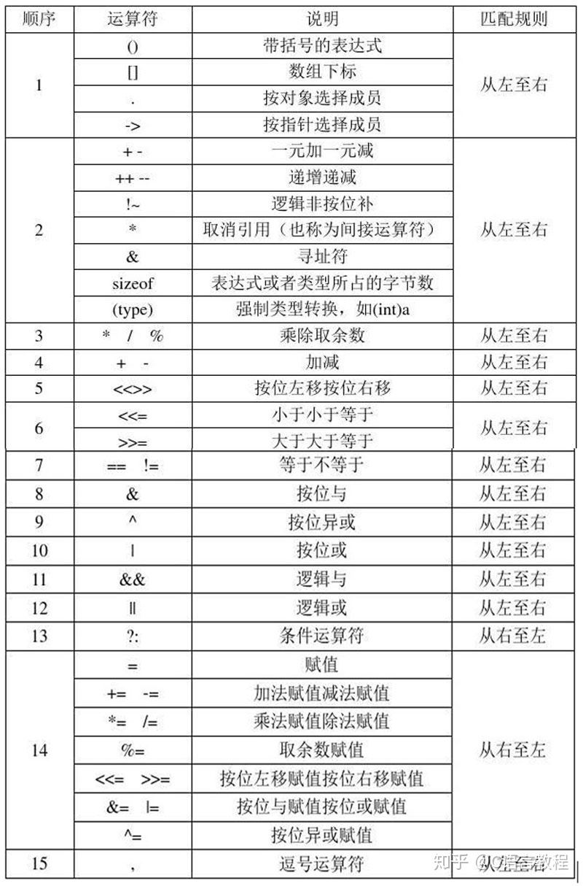
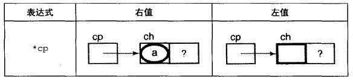

# README
此部分讲述以下方面：
- 简述指针与操作符（优先级、常用表达式）
- 指针与数组
- 指针与字符串
  
# 指针与操作符
操作符具有优先级，指针作为操作符中的一员，同样也具有优先级。  
我们当然可以对每个操作符使用()来确定谁先执行，但过多的括号无疑会影响可读性。  
因此，了解操作符的优先级也是十分必要的。  
  
其中，最常用的就是*和++、--的组合，以下是部分组合：
- *cp
- *(cp + 1)
- *cp++
- *cp--
- *++cp
- *--cp

## *cp
```c
#include<stdio.h>
int main()
{
	char a = 'a';
	char *pa = &a;
	printf("%c",*pa);
	return 0;
}
//输出：a
```
```c
//指针初始化的方法：
(1)char *pa = &a;
(2)char *pa;
   pa = &a;
```
  

## *(cp + 1)

## *cp++

## *cp--

## *++cp

## *--cp

# 指针与数组
- 双重指针
# 指针与字符串
"0123456789ABCDEF"[0]就是字符'0'